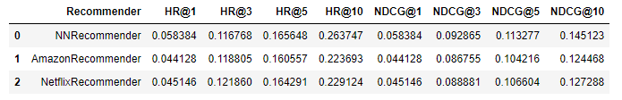

# Recommender Systems Project: Neural Network recommender

Author: Piotr Kondratowicz

## Project description

The aim of this project was to create a neural network recommender based on hotel data.
Some parts of this project were taken from my previous recommender (Content-based recommender) like data preprocessing or creating user and item features.
To create this recommender I used PyTorch library.

The final goal was to achieve as high HR@10 as possible and perhaps beat Amazon and Netflix Recommenders.

## Results and conclusions
The results are shown in a table below:

My recommender (HR@10: 0.263747) was able to beat Amazon Recommender (HR@10: 0.223693) and Netflix Recommender (HR@10: 0.229124).
Comparing to my previous project on the same data I also managed to get a better HR@10.

Linear Regression Content-based Recommender: HR@10: 0.239308

Neural Network Recommender: HR@10: 0.263747

More info about this project can be found in summary in "project_2_recommender_and_evaluation.ipynb"

## Requirements to run
<pre>
Python 3.8 or newer
pip install jupyter
pip install numpy
pip install pandas
pip install matplotlib
pip install seaborn
pip install sklearn
pip install hyperopt
pip install torch
</pre>
